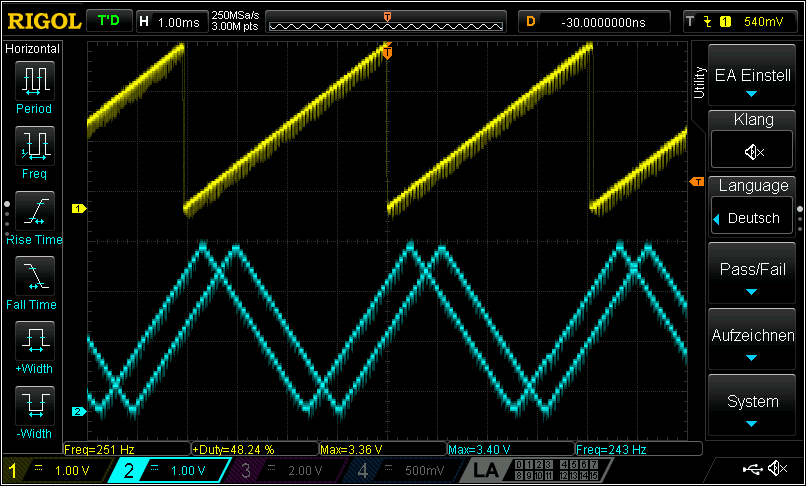

# Pico Function Generator

This project aims to create an entry-level function generator based on the Raspberry Pico (RP2040).

## Features

- Two separate output channels with 12-Bit amplitude resolution
- Supported waveforms:
  - Constant voltage
  - Rectangle: Configurable frequency and duty cycle
  - Sawtooth: Configurable frequency, amplitude and direction
  - Triangle: Configurable frequency and amplitude
  - Sine: Configurable frequency and amplitude

## Details

The function generator uses two 12-Bit DAC ([MCP4725](https://ww1.microchip.com/downloads/en/devicedoc/22039d.pdf)) connected via separate I²C buses to generate different
waveforms.

The UI is displayed on a 128x54 pixel OLED monochrome display based on the [SH1106 controller](https://cdn.velleman.eu/downloads/29/infosheets/sh1106_datasheet.pdf)
connected via a separate I²C bus. The screens are created using [LVGL v9.3](https://lvgl.io/)

The DACs are driven in a loop by core0 while the UI is handled by core1.

## Road map

- [x] Basic PWM based on GPIO (frequency and duty cycle can be set)
- [x] Integrated library to set analog voltage of two MCP4725 12-Bit DACs via I²C using i2c0 and i2c1
- [x] Integrated suitable library for SH1106 monochrome 1.3" display via I²C using i2c1
- [x] Update display via PIO based separate I²C to not interfere with tight DAC loops
- [x] Make DAC waveform non-blocking
- [ ] Create mock-up UI to show current waveform, frequency and enabled for each channel
- [ ] Add enable buttons for each channel
- [ ] Connect UI to actual channel data
- [ ] Add inputs to change waveform and frequency

## How to build the software

The software can be built and flashed using the official [Raspberry Pi Pico extension](https://marketplace.visualstudio.com/items?itemName=raspberry-pi.raspberry-pi-pico).

The target hardware is the [Raspberry Pi Pico](https://www.raspberrypi.com/products/raspberry-pi-pico/) which is based on a dual-core ARM Cortex M0+ processor.

## How to connect the hardware

The GPIO pins of the **Raspberry Pico** are connected as follows:

GPIO-Pin-Number|Function
---|--------
0  | Fast PWM Output Channel 0
2  | Fast PWM Output Channel 1
14 | I²C data for LCD
15 | I²C clock for LCD
16 | I²C data for DAC Channel 0
17 | I²C clock for DAC Channel 0
18 | I²C data for DAC Channel 1
19 | I²C clock for DAC Channel 1

## Waveform output

Here is an example capture showing sawtooth and triangle waveforms.
Since the frequency is only calculated based on the estimated duration of the I²C update
there is a lot of jitter. Due to the blocking nature of the Pico SDK I²C-driver the frequency
is also only half of the requested one. This shall be improved in the feature either via
OS task switching when blocking or via DMA for the whole waveform.

Unfortunately, there are no drivers for DMA-based I²C nor for high speed mode (3.4 MHz) as part of the SDK.
Zephyr on the other hand has a lot of drivers, e.g. for the DAC and display but only as a C-interface
and the PIO support is lacking (no I²C driver).

